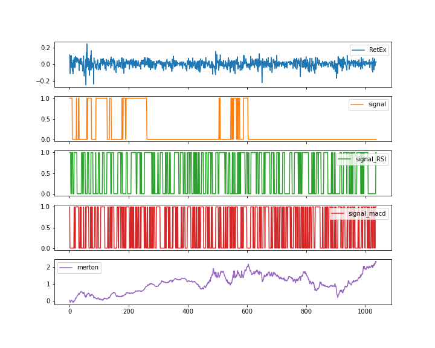

# Reinforcement Learning - Portfolio Choice

This script shows a simple example of applying reinforcement learning on portfolio choice.

The following figure shows the signals I used to define state.

